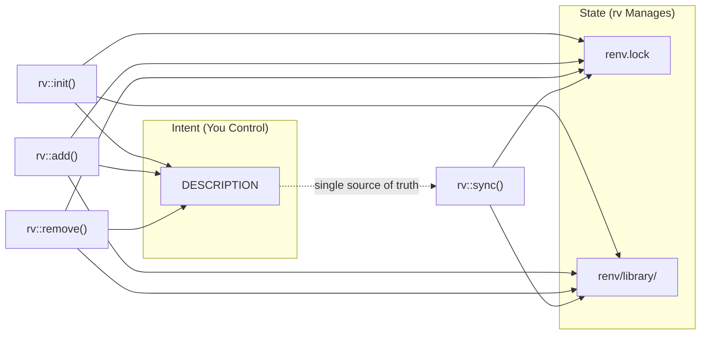

# rv: Fast, Unified Project Management for R

<!-- badges: start -->
[](https://lifecycle.r-lib.org/articles/stages.html#experimental)
[](https://github.com/SInginc/rv/actions/workflows/R-CMD-check.yaml)
[](https://app.codecov.io/gh/SInginc/rv)
<!-- badges: end -->

**`rv`** is a productivity-focused R package manager inspired by Python's `uv`. It provides a single interface to manage project dependencies, using the `DESCRIPTION` file as your **intent** (what you want) and `renv.lock` as your **state** (what you have).

## Why use `rv`?

In standard R, keeping your `DESCRIPTION` file, your installed packages, and your `renv.lock` file in sync is a manual, three-step process. **`rv`** automates this complexity:

* **Manifest-driven:** Uses the standard `DESCRIPTION` file as a `pyproject.toml` equivalent.
* **Blazing Fast:** Uses `pak` under the hood for multi-threaded installations.
* **Explicit Isolation:** Forces `renv` into "explicit" mode—no more accidental dependencies from "junk" scripts.
* **Zero-Config:** Automatically handles `.Rprofile` and repository settings.

---

## Quick Comparison

### rv vs Standard R Workflow

| Action | Standard R (Manual) | R (**`rv`**) |
| --- | --- | --- |
| **Initialize** | Create `DESCRIPTION` manually, run `renv::init()`, configure settings | `rv::init()` |
| **Add Dependency** | Edit `DESCRIPTION`, run `install.packages()`, run `renv::snapshot()` | `rv::add("pkg")` |
| **Remove Dependency** | Edit `DESCRIPTION`, run `remove.packages()`, run `renv::snapshot()` | `rv::remove("pkg")` |
| **Sync Environment** | Run `renv::restore()`, manually check consistency | `rv::sync()` |

### rv vs Python uv

| Action | Python (`uv`) | R (**`rv`**) |
| --- | --- | --- |
| **Initialize** | `uv init` | `rv::init()` |
| **Add Dependency** | `uv add pkg` | `rv::add("pkg")` |
| **Remove Dependency** | `uv remove pkg` | `rv::remove("pkg")` |
| **Sync Environment** | `uv sync` | `rv::sync()` |

---

## Installation

```r
# Install from GitHub (recommended)
pak::pak("SInginc/rv")

# Or using remotes
remotes::install_github("SInginc/rv")
```

---

## Usage Example

```r
# 1. Initialize a new project and
rv::init("my_project")
```

```bash
# 2. Restart your R session just like you would do after calling `renv::init()`
```

```r
# 2. Add dependencies
rv::add("dplyr")                    # Add to Imports
rv::add("ggplot2")                  # Add another
rv::add("testthat", dev = TRUE)     # Add to Suggests (dev dependency)

# 3. Work on your project...
# After a git pull or when packages are out of sync:
rv::sync()

# 4. Clean up unused packages
rv::remove("ggplot2")
```

### Workflow Diagram



---

## Key Functions

### `rv::init()`

Initializes a new or existing directory as an `rv` project.

* Creates a `DESCRIPTION` file if it doesn't exist.
* Initializes a "bare" `renv` environment.
* Sets `renv` to **explicit mode** (only tracks packages in `DESCRIPTION`).
* Configures `.Rprofile` to ensure the environment loads on startup.

### `rv::add(pkgs)`

The primary way to grow your project.

* **Manifest Update:** Adds the specified package(s) to the `Imports` section of your `DESCRIPTION`.
* **Fast Install:** Uses `pak` to resolve and install the packages into your local project library.
* **Locking:** Automatically runs an `renv::snapshot()` to update your `renv.lock`.

### `rv::remove(pkgs)`

The clean-up tool.

* Removes the package from the `DESCRIPTION` file.
* Uninstalls the package from the local library.
* Updates the `renv.lock` file to reflect the change.

### `rv::sync()`

Syncs `renv.lock` to match the `DESCRIPTION` file, then restores the local library.

* Updates the lockfile to reflect any changes in `DESCRIPTION`.
* Uses `pak` to speed up the installation process if packages are missing.
* Ideal for use after editing `DESCRIPTION` or after `git pull`.

---

## Error Handling

| Scenario | Error Message | Solution |
| --- | --- | --- |
| No `DESCRIPTION` file | `"No DESCRIPTION file found. Run rv::init() first."` | Run `rv::init()` to initialize the project |
| No packages specified | `"No packages specified."` | Provide package names to `rv::add()` or `rv::remove()` |
| Missing `renv` or `pak` | `"The following required packages are missing: ..."` | Install `renv` and `pak` first |

---

## .gitignore Recommendations

**Commit these files** (shared across team):
- `DESCRIPTION` — your project's intent (dependencies)
- `renv.lock` — exact versions for reproducibility
- `.Rprofile` — ensures `renv` activates on startup
- `renv/settings.json` — renv configuration
- `renv/activate.R` — renv bootstrap script

**Ignore these** (machine-specific):
```gitignore
# Local library (regenerated by rv::sync)
renv/library/

# renv staging/sandbox
renv/staging/
renv/sandbox/

# User-specific files
.Renviron
*.Rproj.user
```

---

## Migrating from Existing renv Projects

If you have an existing `renv` project:

```r
# 1. Ensure your DESCRIPTION lists all intended dependencies
#    (Check Imports and Suggests sections)

# 2. Set renv to explicit mode
renv::settings$snapshot.type("explicit")

# 3. Enable pak for faster installs
#    Add to .Renviron: RENV_CONFIG_PAK_ENABLED=TRUE

# 4. Sync to ensure consistency
rv::sync()
```

> **Note:** After migration, use `rv::add()` and `rv::remove()` instead of manually editing `DESCRIPTION`.

---

## The `rv` Philosophy: "Intent vs. State"

`rv` enforces a strict separation between what you *intend* to use and the *state* of your machine:

1. **Intent (`DESCRIPTION`):** You edit this (or use `rv::add()`). It lists top-level packages and version constraints.
2. **State (`renv.lock`):** `rv` manages this. It is a machine-readable JSON containing the exact version and hash of every nested dependency.

> **Note:** By using `rv`, you never have to worry about `renv` scanning your entire folder for `library()` calls. If it's not in the `DESCRIPTION`, it's not in the project.

---

## Specifications

To build **`rv`** as a robust orchestrator, the specifications must clearly define how each function interacts with the three underlying pillars: the **Manifest** (`DESCRIPTION`), the **Environment** (`renv`), and the **Engine** (`pak`).

Below are the technical specifications for the core API.

---

## 1. `rv::init()`

**Objective:** Transform a directory into a managed `rv` workspace.

**Arguments:**

* `path`: Directory path (defaults to current).
* `repos`: Character vector of CRAN-like repositories.

**Logical Flow:**

1. **Infrastructure:** Create `DESCRIPTION` if missing.
2. **State Init:** Call `renv::init(bare = TRUE)`. This creates the `renv/` folder and `renv.lock` without scanning files.
3. **Policy Setting:** Set `renv::settings$snapshot.type("explicit")`. This is non-negotiable for the `rv` workflow.
4. **Bootstrapping:** Write `source("renv/activate.R")` to `.Rprofile`.
5. Append `options(repos = ...)` to `.Rprofile` to ensure the "Intent" for sources is saved.
6. Set `RENV_CONFIG_PAK_ENABLED=TRUE` in `.Renviron` to enable `pak` as the installation engine.

**Exit State:**

A project ready for `rv::add()`, with a clean local library and an empty `renv.lock`.

---

## 2. `rv::add()`

**Objective:** The "uv add" equivalent. Declare, install, and lock a dependency.

* **Arguments:**
  * `pkgs`: Character vector of package names (supports `user/repo` for GitHub).
  * `dev`: Defaults to `FALSE`. If `FALSE`, adds packages to `"Imports"` section. If `TRUE`, adds packages to `"Suggests"` section.

* **Logical Flow:**

1. **Validation:** Check if `pkgs` are valid strings.
2. **Manifest Update:** Use the `desc` package to append packages to the `DESCRIPTION` file.
3. **Installation:** Call `renv::install()` with `pak` enabled via `RENV_CONFIG_PAK_ENABLED`.

   * *Note:* When `pak` is enabled, `renv` uses it for speed and dependency resolution.

4. **Locking:** Call `renv::snapshot(prompt = FALSE, dev = TRUE)` to capture both `Imports` and `Suggests`.

   * Because we are in "explicit" mode, `renv` looks at `DESCRIPTION`, sees the new package, and writes its version/hash into `renv.lock`.

* **Exit State:** Package is in `DESCRIPTION`, installed in `renv/library`, and recorded in `renv.lock`.

---

## 3. `rv::remove()`

**Objective:** Reverse the `add` process cleanly.

* **Arguments:**
  * `pkgs`: Character vector of package names to remove.

* **Logical Flow:**

1. **Manifest Update:** Remove packages from `DESCRIPTION` using `desc::desc_del_dep()`.
2. **Cleanup:** Call `renv::remove(pkgs)`. This deletes the files from the project-local library.
3. **Locking:** Call `renv::snapshot(prompt = FALSE, dev = TRUE)`.

   * `renv` sees the package is gone from `DESCRIPTION` and removes it (and its unused dependencies) from `renv.lock`.

* **Exit State:** Package and its orphans are removed from the disk and the lockfile.

---

## 4. `rv::sync()`

**Objective:** Ensure the local library perfectly matches the `DESCRIPTION` file.

* **Logical Flow:**

1. **Comparison:** Compare `DESCRIPTION` against the current contents of `renv.lock`:
    * What packages (and their dependencies) are in `DESCRIPTION` but not in renv.lock?
    * What packages (and their dependencies) are not in `DESCRIPTION` but in renv.lock?
2. Install missing dependencies with `renv::install(c(...), lock = TRUE)`
3. Remove extra dependencies

* **Exit State:** The local environment is a perfect binary mirror of the `renv.lock` file.

---

## Summary of Interaction Logic

| Function | Primary Tool | Target File | Impact |
| --- | --- | --- | --- |
| `init` | `renv` | `.Rprofile` | Environment Architecture |
| `add` | `desc` + `pak` | `DESCRIPTION` | Manifest & Library |
| `remove` | `desc` + `renv` | `DESCRIPTION` | Manifest & Library |
| `sync` | `renv` + `pak` | `renv.lock` | Library State |

---
